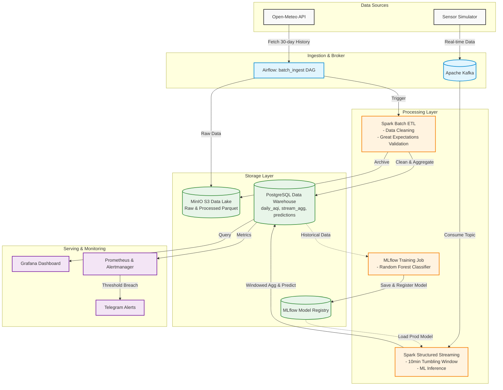

# Arsitektur Pipeline Data "AQI Watch Surakarta"

Dokumen ini menjelaskan desain arsitektur *end-to-end* dari sistem monitoring dan prediksi kualitas udara (Air Quality Index - AQI) Kota Surakarta. Sistem ini dirancang untuk memproses data dalam dua jalur utama: **Batch Processing** (historis) dan **Stream Processing** (real-time).

## Diagram Arsitektur (End-to-End)

---

## Penjelasan Komponen Utama

### 1. Data Sources (Sumber Data)
* **Open-Meteo API**: Digunakan sebagai sumber data cuaca dan kualitas udara historis secara gratis tanpa batasan limit ketat, ditarik melalui Airflow DAG harian.
* **Sensor Simulator (`api_ingestor.py`)**: Script Python yang meniru perilaku perangkat IoT dengan menarik data *real-time* terkini lalu didorong ke dalam sistem _message broker_.

### 2. Ingestion & Message Broker
* **Apache Airflow**: Berperan sebagai _orchestrator_ utama. Bertugas menjadwalkan pengambilan data historis tiap pagi (06:30) serta melatih ulang model Machine Learning setiap minggunya.
* **Apache Kafka**: Berfungsi sebagai penyangga (_buffer_) sekaligus sistem perpesanan publikasi-berlangganan (pub/sub). Kafka menerima ribuan data *real-time* dari sensor tanpa membebani sistem pemrosesan di belakangnya, sehingga menjamin toleransi kesalahan (_fault tolerance_).

### 3. Processing Layer (Pemrosesan Data)
Layer ini ditenagai oleh **Apache Spark**:
* **Spark Batch ETL**: Memproses data harian yang diunduh dari Open-Meteo. Melakukan validasi kualitas data menggunakan **Great Expectations** untuk memastikan tidak ada anomali (misalnya rentang PM2.5 yang tidak masuk akal) sebelum menyimpan data bersih.
* **Spark Structured Streaming**: Membaca rentetan data *real-time* dari Kafka, lalu mengelompokkannya (_windowing_) per 10 menit. Di saat yang sama, Spark Streaming menggunakan model ML yang ada untuk memprediksi kategori ISPU (Baik, Sedang, Tidak Sehat) *on-the-fly*.
* **MLflow Training Job**: Menggunakan *Random Forest Classifier* (Scikit-Learn) untuk mempelajari pola cuaca historis dalam menentukan indeks polusi udara.

### 4. Storage Layer (Penyimpanan)
* **MinIO (S3 Compatible)**: Berperan sebagai **Data Lake**. Semua data mentah (format JSON/CSV asli) dan data hasil pembersihan (format Parquet) disimpan di sini untuk keperluan pengarsipan panjang atau *retraining* besar-besaran di masa depan.
* **PostgreSQL**: Berperan sebagai **Data Warehouse**. Dioptimalkan untuk kueri cepat oleh _dashboard_. Tabel yang disajikan meliputi agregasi harian (`daily_aqi`), agregasi streaming (`stream_agg`), log audit (`pipeline_audit`), dan hasil inferensi (`predictions`).
* **MLflow Registry**: Menyimpan *state* parameter model, akurasi, dan file `.pkl` (pickle) dari model terbaik (Stage: Production).

### 5. Serving & Monitoring (Penyajian Data & Pemantauan)
* **Grafana**: Menyediakan _dashboard_ visualisasi komprehensif (Grafik garis *time-series*, Peta geospasial, metrik ISPU terkini) yang selalu diperbarui dalam hitungan detik (untuk data stream) dan harian (untuk data batch).
* **Prometheus & Alertmanager**: Secara proaktif memantau metrik data (misalnya tingkat Kafka _Consumer Lag_, atau indikasi kualitas udara memburuk). Jika metrik melewati batas yang ditetapkan (threshold), Alertmanager akan mengirimkan pesan notifikasi darurat langsung ke Telegram secara otomatis.
